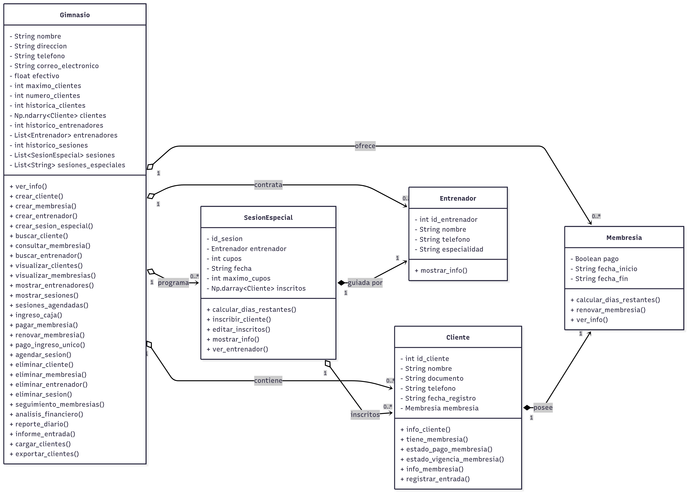

<h1><a href="https://github.com/ema28pro/Sistema-Gimnasio-3Stars-Solutions">Sistema Gimnasio 3Stars Solutions</a></h1>

 

---
Proyecto Final del Curso de Lógica y Representación I, Sistema de Gestión de Membresías Gimnasio en Python usando Numpy, DateTime y persitencia en archivos, por 3Stars Solutions.

## 📌 Descripción del Proyecto
Este sistema fue creado para mejorar la gestión administrativa del gimnasio Body Force, reemplazando el manejo manual de registros por un sistema automatizado hecho en Python.

El programa permite registrar clientes, gestionar membresías, llevar el control de entradas y generar reportes financieros básicos.

### Problema
**Proyecto 5**: Un Gimnasio tiene como objetivo mejorar la gestión y funcionamiento
de sus procesos. Actualmente, enfrenta desafíos en el registro de nuevos miembros,
seguimiento de membresías existentes y análisis financiero. Se busca una solución
que optimice estas áreas, proporcionando una experiencia más eficiente tanto para
los clientes como para el personal del gimnasio.
La solución requerida debe abordar los siguientes aspectos clave: registro y gestión
de clientes, seguimiento de membresías y pagos, así como la generación de
informes diarios que incluyan datos relevantes para la toma de decisiones del
negocio, como el número de clientes atendidos y los ingresos generados y demás
información relevante para el negocio.

## ⚙️ Funcionalidades Principales
- Registro y gestión de clientes.
- Compra y pago de membresías.
- Registro de ingresos por día o membresía.
- Reservas a sesiones especiales (Boxeo, Yoga, Aeróbicos).
- Generación de reportes diarios y financieros.
- Visualización y modificación de membresías existentes.

## 🏗️ Estructura del Código
El código está orientado a objetos y dividido en clases:
- Gimnasio: Clase principal que gestiona el sistema.
- Cliente: Representa a los usuarios registrados.
- Membresia: Contiene información de suscripciones.
- Entrenador y SesionEspecial: Control de sesiones grupales.

## Diagrama de Clases

## Integrantes
**Emanuel López Franco :**  

**Santiago Tovar :**  

**Simon Pineda :**  

